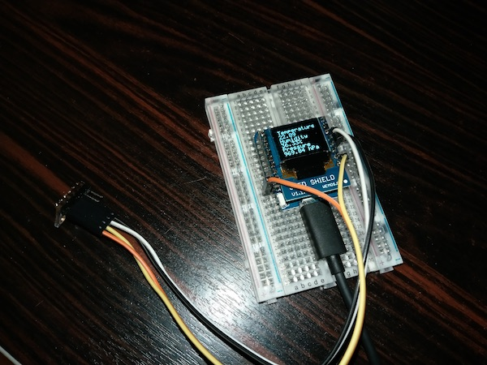

= Simple Weather Station - part 1
xpj
2018-03-18
:jbake-type: post
:jbake-status: published
:jbake-tags: wemos, bmp280, platformio
:idprefix:

Simple Weather Station (SWS) started as a simplified version of bigger outdoor weather station project.

The goal of this project is to play with different hardware piecies and integration with different
platforms and clouds. I'm considering this as a PoC and results will be integrated into
bigger outdoor weather station.

== Hardware

SWS is based on https://wiki.wemos.cc/products:d1:d1_mini_pro[Wemos D1 mini Pro]
connected with https://wiki.wemos.cc/products:retired:oled_shield_v1.1.0[Wemos OLED shied V1.1.0].
For sensing weather data, I'm using https://www.bosch-sensortec.com/bst/products/all_products/bmp280[BMP280] with breakout.

== Software

I decided to use https://platformio.org/[PlatformIO] as a platform for building my project and also for managing
dependencies.

Locally, SWS is showing temperature, humidity and pressure on OLED display and also sends same information
to Serial port.

I'm also trying different IoT platforms and clouds and now SWS is connected to https://www.blynk.cc/[Blynk]
and https://io.adafruit.com/[Adafruit.IO].

Sources are available on https://github.com/xpj/wemos-weather-simple[github.com/xpj/wemos-weather-simple]
