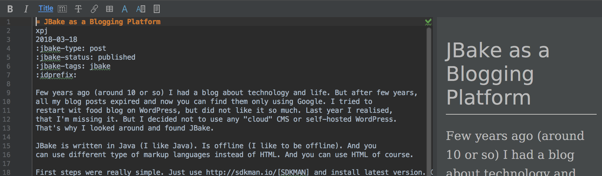
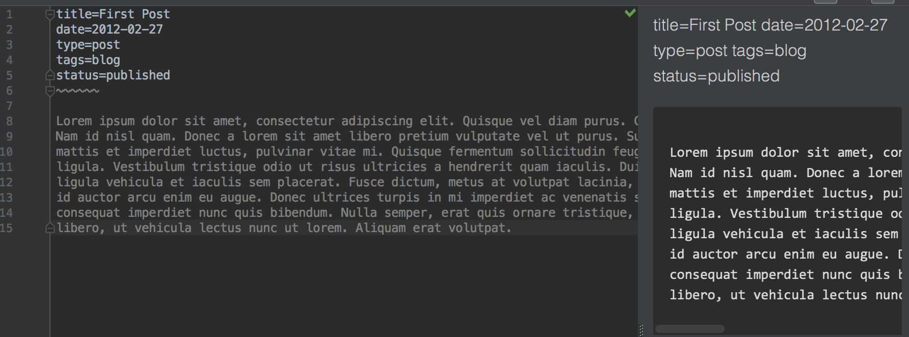

= JBake as a Blogging Platform
xpj
2018-03-18
:jbake-type: post
:jbake-status: published
:jbake-tags: jbake
:idprefix:

Few years ago (around 10 or so) I had a blog about technology and life. But after few years,
all my blog posts expired and now you can find them only using Google. I tried to
restart wit food blog on WordPress, but did not like it so much. Last year I realised,
that I'm missing it. But I decided not to use any "cloud" CMS or self-hosted WordPress.
That's why I looked around and found JBake.

JBake is written in Java (I like Java). Is offline (I like to be offline). And you
can use different type of markup languages instead of HTML. And you can use HTML of course.

First steps were really simple. Just use http://sdkman.io/[SDKMAN] and install latest version. Change
few properties in `jbake.properties` file and simply run `jbake -b`.

Deployment was one `scp` command to existing domain and source of this blog is available on GitHub
(https://github.com/xpj/xpj.ninja[github.com/xpj/xpj.ninja]).

I also little bit changed templates to use latest https://getbootstrap.com/[Bootstrap], installed
https://useiconic.com/open/[Open Iconic] icons and theme https://bootswatch.com/superhero/[Superhero].

I really like how it works in my IntelliJ Idea. I chose Ascii Doctor format because of included metadata,
that are not breaking preview. You can see difference in following screenshots:

== PlantUML and Ascii Doctor

Currently we found project PlantUML for writing UML diagrams-as-a-code. This is really
hype to have everything in version control and it is always better to version
text source that images or binary files. I was really happy that AsciiDoctor and JBake
support this, but it was little bit tricky to get it work. And it is still not how
it could be.

First problem was how to get it work. I'm using standalone JBake and all
examples are pointing to Gradle builds. It was easier than I expect,
just add following line to my `jbake.properties`:

[source]
asciidoctor.option.requires = asciidoctor-diagram

Next step was to include generated diagrams into result pages. I was debuging JBake,
looking into properties files, trying this and that, because generated images
had wrong `src` attribute. Finally I figured, that it was as simple as adding `./` in
front of the file name:

[source]
------
[plantuml, "./sws-interactions", "png"]
----
SWS -> Blynk: Data
SWS -> Adafruit.io: Data
----
------

[plantuml, "./sws-interactions", "png"]
----
SWS -> Blynk: Data
SWS -> Adafruit.io: Data
----

