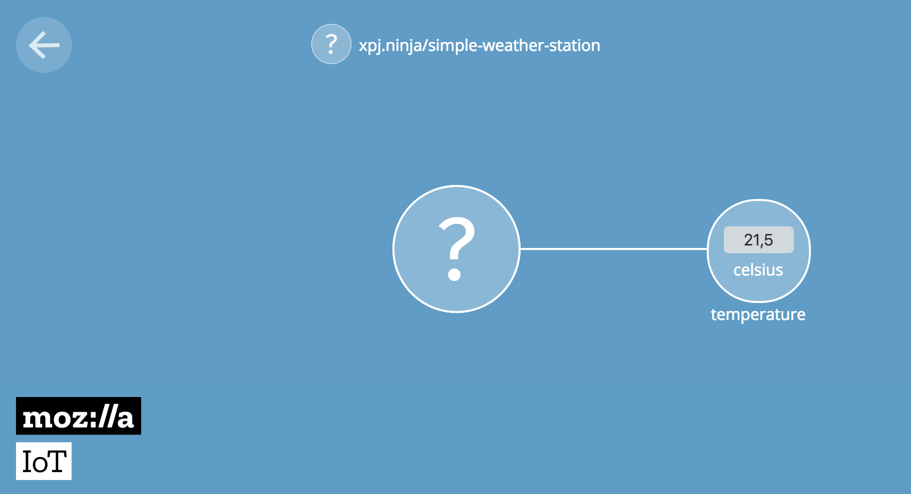

= Mozilla IoT Gateway
xpj
2018-04-09
:jbake-type: post
:jbake-status: published
:jbake-tags: mozilla, iot, wemos
:idprefix:

== Mozilla IoT Gateway
Recently, Emerging Technologies team at Mozilla published first public available release
of their http://https://iot.mozilla.org/gateway/[Mozilla IoT Gateway] and draft of
https://iot.mozilla.org/specification[Web Thing API].

Mozilla IoT Gateway is experimental project to connect "things" to the web and is the first
component of the Project Things (others are Things Cloud and Things Framework). This sounds
really good to me so I ordered brand new Rapsberry Pi 3B+ for testing what is it and
how it works.

First steps were not so optimistic. Mozilla IoT Gateway is distributed as an image for
flashing on SD card, but image was created from older Raspbian and newest RPi failed to boot.

Second try was to build Mozilla IoT Gateway from scratch following the guide on
https://github.com/mozilla-iot/gateway[GitHub]. In this case I was able to compile and
run gateway on my RPi. That was sucessful and after some research, my experimental weather
station was able to announce own existence to the Gateway and send some property
 (using https://github.com/fiz1962/ESP-adapter[ESP Adapter])

== Second Look

After first success, I dig more into Web Thing API. It looks pretty simple, both REST and
WebSockets are available. Registration and other interactions are as simple as responding
to some requests.

But after digging deeper into documents I found, that this gateway is not suitable
for small IoT devices like low-power weather stations. Mozilla IoT Gateway expects,
that every device has REST endpoints available and this implicates web server running
on each device.

For small devices it is more common to send MQTT messages and from design of
Gateway, this will not be supported: https://github.com/mozilla-iot/gateway/issues/637

I can imagine usecase with weather station sleeping almost whole day, waking up just for
few seconds every 5 minutes to send new sensor data. With Mozilla IoT Gateway this
is not possible, because it will ask web server running on your weather station
for new sensor data using Web Things API.

== Conclusion

Mozilla IoT Gateway is really interesting piece of code with great idea of
standard API for IoT devices. Unfortunately, it works just like gateway for devices
like smart bulbs, smart outlets etc. For us, engineers with tiny controllers
running from batteries, this is not yet usable.

But I hope in near future, we will see support for MQTT protocol and probably
some other features suitable for low-power experiments.
