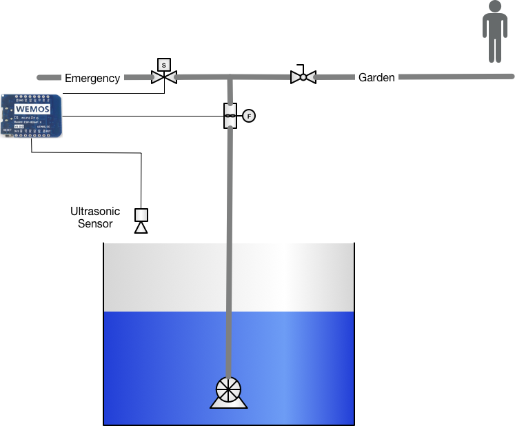

= Water Tank Project
xpj
2018-05-23
:jbake-type: post
:jbake-status: published
:jbake-tags: pump, solenoid valve, flow sensor, iot, wemos
:idprefix:

Water tank project is really old project. In beginning of reconstruction of our house,
we decided to throw debris into old septic tank. Our house was already connected to
municipal sewerage and we saved money for transport and storage of around 5m3 of debris.

But after few years we were thinking about some tank for rain water. And because one
half of roof was already pointed into that old septic tank, I started with removing of
debris from that tank. It was rally hard and painful,  and took me 4 years to complete.

Now the tank is empty and ready for all the rain water except isolation with special paint.
And this is beginning of new Water Tank Project.

Idea is to use submersible pump with pressure sensor. In this case you don't need
pressure tank because pump started right after you open valve. My project uses
this idea for activation of pump in emergency case when the level of water exceeds
safe level.

As addition I will add display to show some properties on display like water level, actual
volume of water in tank and, as usual, temperature in tank :-)

